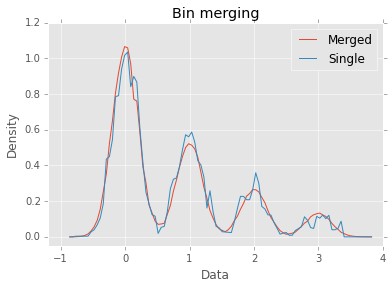

**Note**: For an actively maintained alternative, see https://github.com/maki-nage/distogram

Overview
========

This project is an implementation of the streaming, one-pass histograms
described in Ben-Haim's `Streaming Parallel Decision
Trees <http://jmlr.org/papers/volume11/ben-haim10a/ben-haim10a.pdf>`__.
The histograms act as an approximation of the underlying dataset. The
histogram bins do not have a preset size, so as values stream into the
histogram, bins are dynamically added and merged as needed. One
particularly nice feature of streaming histograms is that they can be
used to approximate quantiles without sorting (or even individually
storing) values. Additionally, they can be used for learning,
visualization, discretization, or analysis. The histograms may be built
independently and merged, making them convenient for parallel and
distributed algorithms.

This ``Python`` version of the algorithm combines ideas and code from
`BigML <https://bigml.com>`__'s `Streaming Histograms for
Clojure/Java <https://github.com/bigmlcom/histogram>`__ and
`VividCortex <https://vividcortex.com>`__'s `Streaming approximate
histograms in Go <https://github.com/VividCortex/gohistogram>`__.

Installation
============

``streamhist`` has not yet been uploaded to
`PyPi <https://pypi.python.org/pypi>`__, as we are currently at the
'pre-release' stage. Having said that you should be able to install it
via ``pip`` directly from the GitHub repository with:

.. code:: bash

    pip install git+git://github.com/carsonfarmer/streamhist.git

You can also install ``streamhist`` by cloning the `GitHub
repository <https://github.com/carsonfarmer/streamhist>`__ and using the
setup script:

.. code:: bash

    git clone https://github.com/carsonfarmer/streamhist.git
    cd streamhist
    python setup.py install

Testing
=======

``streamhist`` comes with a relatively comprehensive range of tests,
including unit tests and regression tests. To run the tests, you can use
``pytest``, which can be installed via ``pip``
using the ``recommended.txt`` file (note, this will also install
``numpy``, ``matplotlib``, and ``IPython`` which are used for tests and
examples):

.. code:: bash

    pip install -r recommended.txt
    pytest streamhist

Features
========

In the following examples we use ``numpy`` to generate data and
``matplotlib`` for plotting.

.. code:: python

    import numpy as np
    import matplotlib.pyplot as plt
    %matplotlib inline
    plt.style.use("ggplot")  # Makes for nicer looking plots
    
    try:
        from functools import reduce
    except ImportError:
        pass
    
    from streamhist import StreamHist
Basics
------

The simplest way to use a ``StreamHist`` is to initialize one and then
``update`` it with data points. In this first example, we create a
sequence of 200k samples from a normal distribution (mean=0; variance=1)
and add them to the histogram:

.. code:: python

    normal_data = np.random.normal(0.0, 1.0, 200000)
    h1 = StreamHist(maxbins=32)  # Create histogram with 32 bins
    h1.update(normal_data)       # Add points all at once


.. parsed-literal::

    <streamhist.histogram.StreamHist at 0x106661a50>


You can use the ``sum`` method to find the approximate number of points
less than a given threshold:

.. code:: python

    h1.sum(0.0)


.. parsed-literal::

    100083.47447715153


The ``density`` method gives us an estimate of the point density at the
given location:

.. code:: python

    h1.density(0.0)


.. parsed-literal::

    80110.665112511764


The ``count``, ``mean``, ``median``, ``min``, ``max``, and ``var``
methods return useful summary statistics for the underlying dataset
(some methods return approximate results). There is also a ``describe``
method that produces multiple summary statistics:

.. code:: python

    h1.describe()


.. parsed-literal::

    {'25%': -0.70144662062746543,
     '50%': -0.0010543765097598481,
     '75%': 0.6842056241993717,
     'count': 200000,
     'max': 4.4482526912064921,
     'mean': 0.00088520840106445678,
     'min': -4.4169415722166905,
     'var': 0.99109191080479508}


Arbritrary quantiles/percentiles can be found using ``quantile``:

.. code:: python

    h1.quantiles(0.5, 0.95, 0.99)  # Supports multiple quantile inputs


.. parsed-literal::

    [-0.0010543765097598481, 1.6547838836416333, 2.3297886138335397]


Sums and densities
------------------

We can plot the sums and density estimates as functions. First we
compute the data bounds and then we create 100 linearly spaced numbers
whithin those bounds for plotting:

.. code:: python

    l, u = h1.bounds()
    x = np.linspace(l, u, 100)
.. code:: python

    plt.figure()
    y1 = [h1.sum(z) for z in x]
    y2 = [h1.density(z) for z in x]
    plt.plot(x, y1, label="Sum")
    plt.plot(x, y2, label="Density")
    plt.title("Sum and density")
    plt.ylabel("Frequency")
    plt.xlabel("Data")
    plt.legend(loc="best")
    plt.ylim(-5000, 205000)
    plt.show()


.. image:: docs/output_17_0.png


If we normalized the values (dividing by 200K), these lines approximate
the `cumulative distribution
function <http://en.wikipedia.org/wiki/Cumulative_distribution_function>`__
(CDF) and the `probability density
function <http://en.wikipedia.org/wiki/Probability_density_function>`__
(PDF) for the normal distribution. Alternatively, we can compute the CDF
and PDF directly:

.. code:: python

    plt.figure()
    y1 = [h1.cdf(z) for z in x]
    y2 = [h1.pdf(z) for z in x]
    plt.plot(x, y1, label="CDF")
    plt.plot(x, y2, label="PDF")
    plt.title("CDF and PDF")
    plt.ylabel("Density")
    plt.xlabel("Data")
    plt.legend(loc="best")
    plt.ylim(-0.03, 1.03)
    plt.show()


.. image:: docs/output_19_0.png


Bin counts
----------

The histogram approximates distributions using a constant number of
bins. This bin limit can be specified as parameter when creating a
``StreamHist`` object (``maxbins`` defaults to 64). A bin contains a
``count`` of the points within the bin along with the ``mean`` for the
values in the bin. The edges of the bin aren't explicitly captured.
Instead the histogram assumes that points of a bin are distributed with
half the points less than the bin mean and half greater. This explains
the fractional sum in the following example.

.. code:: python

    h2 = StreamHist(maxbins=3).update([1, 2, 3])
    list(h2.bins)


.. parsed-literal::

    [{'count': 1, 'mean': 1}, {'count': 1, 'mean': 2}, {'count': 1, 'mean': 3}]


.. code:: python

    h2.sum(2.)


.. parsed-literal::

    1.0


As mentioned earlier, the bin limit constrains the number of unique bins
a histogram can use to capture a distribution. The histogram above was
created with a limit of just three bins. When we add a fourth unique
value it will create a fourth bin and then merge the nearest two.

.. code:: python

    h2.update(0.5)
    list(h2.bins)


.. parsed-literal::

    [{'count': 2, 'mean': 0.75}, {'count': 1, 'mean': 2}, {'count': 1, 'mean': 3}]


A larger bin limit means a higher quality picture of the distribution,
but it also means a larger memory footprint. In the following example,
we create two new histograms based on a sequence of 300K samples from a
mixture of four Gaussian distributions (means=0, 1, 2, 3; variance=0.2):

.. code:: python

    mixed_normal_data = np.concatenate((
        np.random.normal(0.0, 0.2, 160000),
        np.random.normal(1.0, 0.2, 80000),
        np.random.normal(2.0, 0.2, 40000),
        np.random.normal(3.0, 0.2, 20000)
        ))
    np.random.shuffle(mixed_normal_data)
.. code:: python

    h3 = StreamHist(maxbins=8).update(mixed_normal_data)
    h4 = StreamHist(maxbins=64).update(mixed_normal_data)
In the plot below, the red line represents the PDF for the histogram
with 8 bins and the blue line represents the PDF for the histogram with
64 bins.

.. code:: python

    l, u = h4.bounds()
    x = np.linspace(l, u, 100)
    
    plt.figure()
    y1 = [h3.pdf(z) for z in x]
    y2 = [h4.pdf(z) for z in x]
    plt.plot(x, y1, label="8 Bins")
    plt.plot(x, y2, label="64 Bins")
    plt.legend(loc="best")
    plt.title("Bin (max) counts")
    plt.ylabel("Density")
    plt.xlabel("Data")
    plt.xlim(-1.2, 4)
    plt.ylim(-0.05, None)
    plt.show()


.. image:: docs/output_29_0.png


Bin weighting
-------------

Another option when creating a histogram is to use *gap weighting*. When
``weighted`` is ``True``, the histogram is encouraged to spend more of
its bins capturing the densest areas of the distribution. For the normal
distribution that means better resolution near the mean and less
resolution near the tails. The chart below shows a histogram with gap
weighting in red and without gap weighting in blue. Near the center of
the distribution, red uses more bins and better captures the Gaussian
distribution's true curve.

.. code:: python

    h5 = StreamHist(maxbins=8, weighted=True).update(normal_data)
    h6 = StreamHist(maxbins=8, weighted=False).update(normal_data)
.. code:: python

    l, u = h5.bounds()
    x = np.linspace(l, u, 100)
    
    plt.figure()
    y1 = [h5.pdf(z) for z in x]
    y2 = [h6.pdf(z) for z in x]
    plt.plot(x, y1, label="Weighted")
    plt.plot(x, y2, label="Unweighted")
    plt.legend(loc="best")
    plt.title("Bin weighting")
    plt.ylabel("Density")
    plt.xlabel("Data")
    plt.xlim(-4.5, 4.5)
    plt.ylim(-0.02, None)
    plt.show()


.. image:: docs/output_32_0.png


Merging
-------

A strength of the streaming histograms is their ability to merge with
one another. Histograms can be built on separate data streams (and/or
nodes, processes, clusters, etc) and then combined to give a better
overall picture.

In this example, we first create 300 samples from the mixed Gaussian
data, and then stream each sample through its own ``StreamHist``
instance (for a total of 300 unique ``StreamHist`` objects). We then
merge the 300 noisy histograms to form a single merged histogram:

.. code:: python

    # Create 300 samples from the mixed Gaussian data
    samples = np.split(mixed_normal_data, 300)
    
    # Create 300 histograms from the noisy samples
    # This might take a few seconds...
    hists = [StreamHist().update(s) for s in samples]
    
    # Merge the 300 histograms
    h7 = sum(hists)  # How cool is that!
In the following plot, the red line shows the density distribution from
the merged histogram, and the blue line shows one of (the last one in
the list) the original histograms:

.. code:: python

    min, max = h7.bounds()
    x = np.linspace(min, max, 100)
    
    plt.figure()
    y1 = [h7.pdf(z) for z in x]
    y2 = [hists[-1].pdf(z) for z in x]
    plt.plot(x, y1, label="Merged")
    plt.plot(x, y2, label="Single")
    plt.legend(loc="best")
    plt.title("Bin merging")
    plt.ylabel("Density")
    plt.xlabel("Data")
    plt.xlim(-1.2, 4)
    plt.ylim(-0.05, None)
    plt.show()





Missing Values
--------------

Information about missing values is captured whenever the input value is
``None``. The ``missing_count`` property retrieves the number of
instances with a missing input. For a basic histogram, this count is
likely sufficient. It is provided in the case that this type of
information is relevant for more complex summaries.

.. code:: python

    h8 = StreamHist().update([None, 7, None])
    h8.missing_count


.. parsed-literal::

    2


Performance-related concerns
----------------------------

Freezing a ``StreamHist``
~~~~~~~~~~~~~~~~~~~~~~~~~

While the ability to adapt to non-stationary data streams is a strength
of the histograms, it is also computationally expensive. If your data
stream is stationary, you can increase the histogram's performance by
setting the ``freeze`` threshold parameter. After the number of inserts
into the histogram have exceeded the ``freeze`` parameter, the histogram
bins are 'locked' into place. As the bin means no longer shift, inserts
become computationally cheap. However the quality of the histogram can
suffer if the ``freeze`` parameter is too small.

.. code:: python

    # This takes quite a while (~2.7s each run for the 'frozen' histogram)...
    %timeit StreamHist().update(normal_data)
    %timeit StreamHist(freeze=1024).update(normal_data)

.. parsed-literal::

    1 loops, best of 3: 11.2 s per loop
    1 loops, best of 3: 2.65 s per loop


Sorted list
~~~~~~~~~~~

The bin reservoir used to store the ``StreamHist`` bins is a sorted list
as implemented in the
```SortedContainers`` <https://github.com/grantjenks/sorted_containers>`__
library. There are many performance-related reasons for using this
library, and `implementation
details <http://www.grantjenks.com/docs/sortedcontainers/implementation.html>`__
and `performance
comparisons <http://www.grantjenks.com/docs/sortedcontainers/performance.html>`__
are available for those who are interested.

Update speeds
~~~~~~~~~~~~~

Currently, ``StreamHist`` has minimal dependencies. The only
non-standard library dependency is
```SortedContainers`` <https://github.com/grantjenks/sorted_containers>`__.
This has been a concious design choice. However, in order to improve
update speeds (and other bottlenecks), we are exploring other options,
including the use of ```NumPy`` <http://www.numpy.org>`__, which
provides fast, powerful array-like objects, useful linear algebra, and
other features which may improve scalability and efficiency.

Rendering/plotting
------------------

There are multiple ways to visualize a ``StreamHist`` histogram. Several
of the examples here provide ways of plotting the outputs via
``matplotlib``. In addition, there are two methods which provide quick
access to histogram plotting functionality: ``compute_breaks`` which
provides histogram breaks similarly to ``numpy.histogram`` and
``print_breaks``, which 'prints' the histogram breaks to the console for
quick visualization.

.. code:: python

    from numpy import histogram, allclose
    length = normal_data.shape[0]
    bins = 25
    h9 = StreamHist().update(normal_data)
    hist1, bins1 = h9.compute_breaks(bins)
    hist2, bins2 = histogram(normal_data, bins=bins)
    
    if allclose(bins1, bins2):
        print("The bin breaks are all close")
    if allclose(hist1, hist2, rtol=1, atol=length/(bins**2)):
        print("The bin counts are all close")

.. parsed-literal::

    The bin breaks are all close
    The bin counts are all close


.. code:: python

    width = 0.7 * (bins2[1] - bins2[0])
    c1 = [(a + b)/2. for a, b in zip(bins1[:-1], bins1[1:])]
    c2 = [(a + b)/2. for a, b in zip(bins2[:-1], bins2[1:])]
    
    f, (ax1, ax2) = plt.subplots(1, 2, sharey=True, figsize=(10, 4))
    ax1.bar(c1, hist1, align='center', width=width)
    ax2.bar(c2, hist2, align='center', width=width)
    ax1.set_title("compute_breaks")
    ax2.set_title("numpy.histogram")
    ax1.set_ylabel("Frequency")
    ax1.set_xlabel("Data")
    ax2.set_xlabel("Data")
    plt.show()


.. image:: docs/output_44_0.png


.. code:: python

    h9.print_breaks(bins)

.. parsed-literal::

    -4.41694157222	
    -4.06233380168	
    -3.70772603114	
    -3.35311826061	
    -2.99851049007	
    -2.64390271953	.
    -2.289294949	...
    -1.93468717846	.....
    -1.58007940792	..........
    -1.22547163738	................
    -0.870863866847	......................
    -0.51625609631	..........................
    -0.161648325774	............................
    0.192959444763	..........................
    0.5475672153	.....................
    0.902174985837	...............
    1.25678275637	..........
    1.61139052691	.....
    1.96599829745	..
    2.32060606798	.
    2.67521383852	
    3.02982160906	
    3.3844293796	
    3.73903715013	
    4.09364492067	
    


License
=======

| Copyright © 2015 Carson Farmer carsonfarmer@gmail.com
| Copyright © 2013 VividCortex
| All rights reserved. MIT Licensed.
| Copyright © 2013 BigML
| Licensed under the Apache License, Version 2.0
